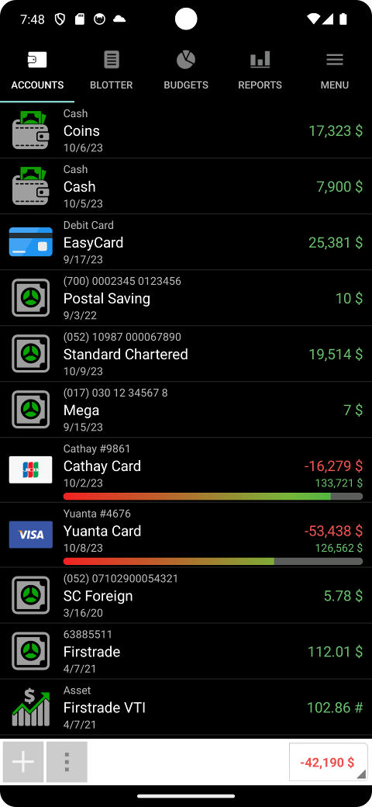
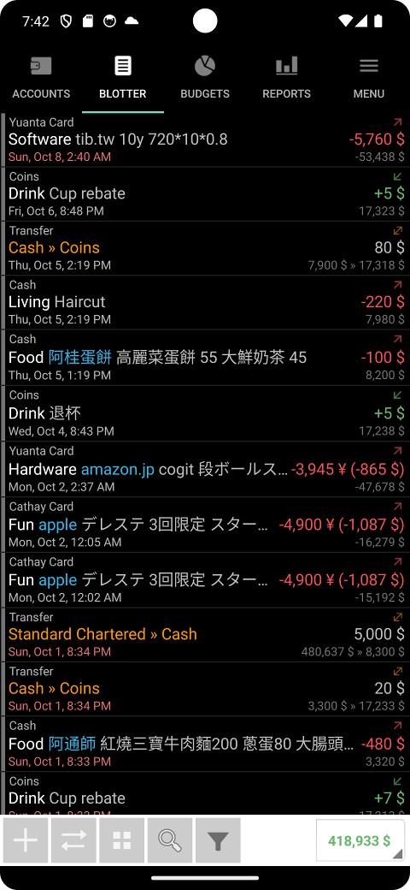
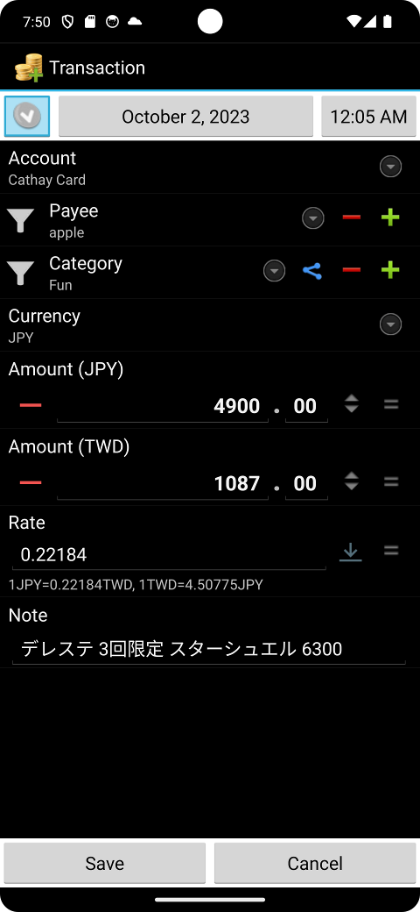
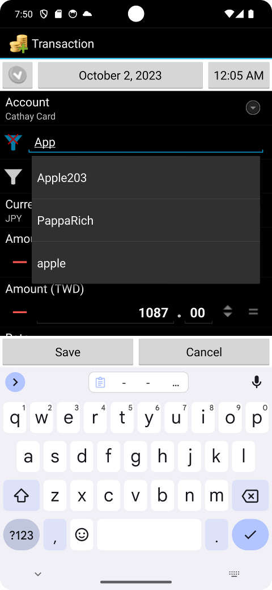

# Financisto Holo

Get it on Google Play: https://play.google.com/store/apps/details?id=tw.tib.financisto

Please see https://github.com/dsolonenko/financisto for latest development by 
orginal author.

This codebase is started from an imported copy of an old version of source code 
at launchpad (https://code.launchpad.net/~financisto-dev/financisto/trunk), as 
an working interim version until proper version 2 comes out.

Old-school, no cloud, no online service. Everything is on your device, unless you explicitly enables
Google Drive and/or Dropbox online backup. I used it for 12+ years but it stopped updated a while ago,
tweaked some quirks to fit my own needs. Hope it helps you too!

BE SURE TO BACKUP YOUR DATA!

* Holo/Material theme (only partial update to Material due to class hierarchy difficult to upgrade ...)
* Date/time picker provided by new Android versions
* Tweaked text layout, support device text scaling
* Search memo text, amount value (even with range)
* Location removed due to huge change in google maps API
* Photo removed due to backup and content linking/updating difficulties
* Backup file compatible with Play store version 1.7.1
* SMS template has been changed to Notification template, supporting other apps' push notification

I have some example scripts that can:

* Exporting Financisto backup files to hledger text format (for easy human read, searching in editor)
* Creating transactions from Taiwan EasyCard
* Importing transaction logs from Taiwan Government Unified Invoice

Find them at: https://github.com/tiberiusteng/financisto-backup-to-hledger