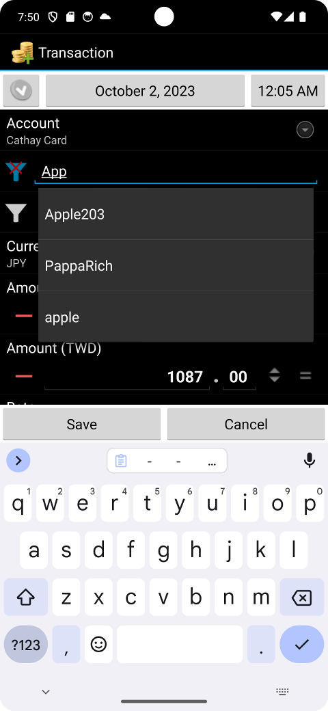

<nav>

**[Home](index.md)** · [Features](features.md) · [Notification templates](notification-templates.md) · [Intents](intents-and-integration.md) · [Currencies](currencies-and-exchange-rates.md) · [Reports](reports-and-budgets.md) · [Backup](backup-and-restore.md) · [Automation](automation-and-scripts.md) · [Changelog](changelog.md) · [Versions](versions-and-forks.md) · [Development](development.md) · [FAQ](faq.md) · [Resources](resources.md)

</nav>

# Features

Features of Financisto Holo. Sources: the in-app What's New changelog, the app's About page, the README and the Play Store description. For the history of each feature see the [Changelog](changelog.md).

## Accounts
- Multiple accounts with types: cash, bank, debit and credit cards, electronic accounts such as PayPal, and others
- Card issuers include UnionPay, RuPay, Mir, NETS and more
- Credit cards: limit amount, configurable closing day, monthly preview and statements, and bill estimation. An option treats a transfer to a credit card as a bill payment
- Account icon can be a character or emoji, with a choosable accent color
- Drag-and-drop account ordering (Edit Account, Sort Order)
- Close accounts, hide closed accounts, and show the last transaction date or the sort order in the list
- Per-account options: exclude from totals, include in reports (a transfer out of a normal account into an excluded one still counts as an expense, which matches envelope budgeting)
- Search the account list by title, number, issuer, note or currency name. This is handy while traveling, to show only accounts of one currency
- Update an account's balance (balance-adjust mode, with the amount field labeled "New balance"; split is allowed in this mode)
- Quick actions: "Transfer current balance" button, new transaction and new transfer from the account quick menu, and an option to blur balances
- A note field per account

## Transactions
- Income, expense and transfer, with a payee on transfers too
- Convert an existing transaction to a transfer, or the reverse (long press in the blotter, last menu item)
- **Split transactions**, with these options:
  - Create categories on the fly and set category attributes
  - Split children may have a separate payee and location, an independent status, and transfer-in
  - Split transfers from or to the current account (experimental)
  - Show split summary or children in the blotter and in mass-op filters
- Transaction statuses: restored, pending, unreconciled, cleared and reconciled. There is an option to prevent editing cleared or reconciled transactions
- Duplicate and copy transactions:
  - Keep the time of day, including an option to place the copy within +1 / -23 hours of now (for end-of-day journaling)
  - Optionally use the project most recently used in the last week
  - Optionally set copied foreign-currency transactions to pending
  - Highlight copied but unedited transactions
- Foreign-currency transactions with an exchange-rate field and a calculator, plus "no project" and project-aware options
- Attach pictures (see [Backup and restore](backup-and-restore.md)), or take a photo to attach directly
- Transaction **tags**: show in the blotter; import, export and reporting are planned
- A built-in calculator with four persistent memories
- Round amounts according to currency settings (can be turned off)
- Remember the last category per account, the last location or project per category, and the last category for a payee. Category suggestions favor those recently used on the active account
- Payees, locations and projects are created from the search text, can be marked inactive, and can have **aliases** used for search and notification matching. Multiple payees can be merged into one
- Search or list selectors for payee, project and location (configurable)
- Category selector with background loading, a hierarchical tree, a funnel-icon search with autocomplete, and the full category path in transactions

## Blotter (transaction list)
- Running balance
- Filter by period, category (including "No Category"), payee, project, location, status (multiple choice) and account
- Saved filters, and ascending or descending date sort
- Search over notes, payee names, category titles and amounts. Search syntax for amounts:
  - `123.45`: exact amount
  - `<123.45` or `>123.45`: less than or greater than
  - `123~456`: a range
  - A plain number matches both amount and note, income or expense alike
- Quick action buttons per transaction status (configurable)
- Show the full note in a separate section (Preferences, Blotter), full split-child attributes, and tags
- Optional: hide the time of day, show the project name, a "Go To Today" button, colorized weekends
- Mass operations: mark transactions as restored, pending or unreconciled, and others
- In the all-transactions blotter, long press a transaction and choose "Show in account blotter"
- Transaction info dialog: touch a field to copy its content

## Scheduled and recurring transactions
- Reworked scheduling with full recurrence rules (RRule), a planner with filter, and 15 recurrence dates shown to help catch month-end issues
- Auto-restore of missed scheduled transactions after the phone was off or after a database restore (can be switched off)
- Notifications when recurrences are created, with individual schedules mutable
- Transaction templates, a launcher shortcut for creating from a template, and a template multiplier

## Budgets
- Recurring budgets: weekly, monthly and yearly
- Budgets on multiple categories and projects, with an account filter, "include credit" and a "no project" option
- Sort by name or period end date, and a totals line
- Create a transaction from a budget with the account auto-selected

## Reports
See [Reports and budgets](reports-and-budgets.md).

## Currencies and exchange rates
See [Currencies and exchange rates](currencies-and-exchange-rates.md).

## Backup, import and export
See [Backup and restore](backup-and-restore.md). In short: local, Dropbox and Google Drive backup, auto-backup, QIF/CSV import and export, and restore of backups from old Financisto, Financier and Financisto 1.8+.

## Security and privacy
- Fingerprint unlock and PIN protection, with an option to skip the PIN for the New Transaction and New Transfer screens and a haptic-feedback option
- Lock the app after a set time
- Hide content in the recent tasks view, and prevent showing data before unlocking
- Everything is stored on the device. Online backup is opt-in

## Automation and integration
- [Notification templates](notification-templates.md), including Google Wallet
- [Intents and shortcuts](intents-and-integration.md): create transactions or backups from other apps (such as MacroDroid)
- Backup file processing with [scripts](automation-and-scripts.md)

## Interface and customization
- Holo look with a partial Material update, edge-to-edge on Android 15+, an adaptive launcher icon, dark button bars and text scaling
- Date and time picker from newer Android versions, with an optional twin picker (calendar and spinner)
- Manual UI language selection. Translations include Czech, Danish, French, German, Italian, Korean, Norwegian, Polish, Portuguese (Brazil), Russian, Slovak, Spanish, Traditional Chinese and Ukrainian
- Configurable first day of the week, fiscal year start, and the startup screen
- Home screen widgets (2x1, 3x1, 4x1) and launcher App Shortcuts
- Dropbox, Google Drive and "send via share intent" options for exports

## Removed or unavailable
- Google Maps-based location features were removed
- SMS-based transaction creation isn't available in the Play build (see [Notification templates](notification-templates.md))
- The old Flowzr sync (a paid third-party service) belongs to older versions and isn't part of Holo's feature set

---

[← Back to Home](index.md)
