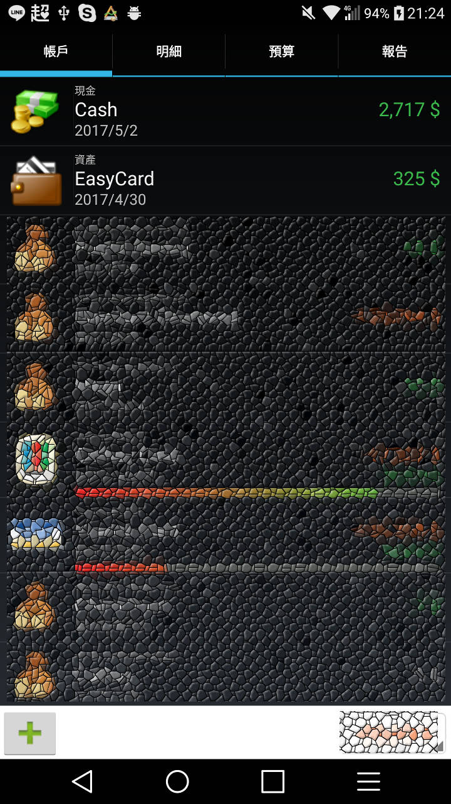
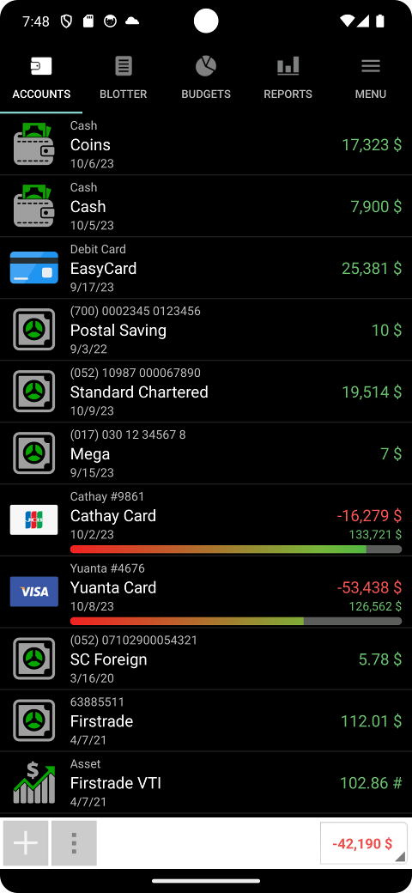
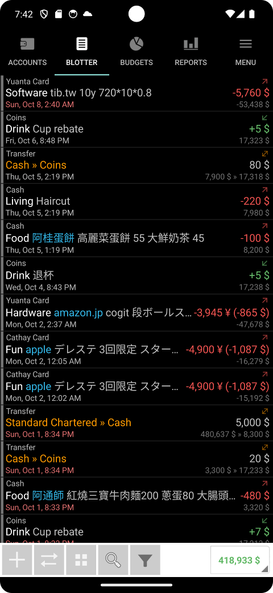
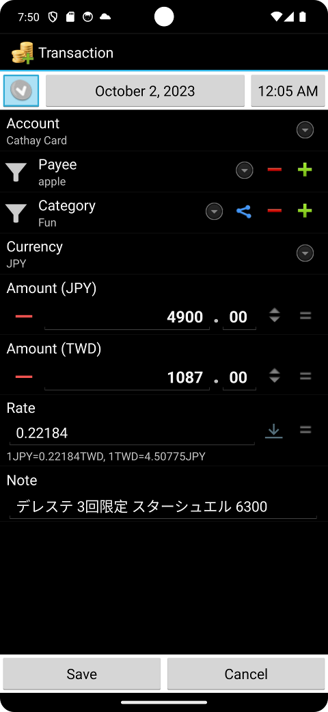

# Financisto Wiki

An unofficial English wiki for **Financisto**, an open-source personal finance tracker for Android.

Financisto is old-school: no cloud and no online service. Everything stays on your device unless you explicitly enable Google Drive and/or Dropbox backup.

> The most actively maintained version is **Financisto Holo** (Google Play id `tw.tib.financisto`), a fork of Financisto 1.6.8. See [Versions and forks](versions-and-forks.md).

## Pages

| Page | What it covers |
|---|---|
| [Features](features.md) | Everything the app can do |
| [Notification templates](notification-templates.md) | Auto-creating transactions from notifications, placeholders, Google Wallet |
| [Intents and shortcuts](intents-and-integration.md) | Intents, launcher shortcuts and widgets |
| [Currencies and exchange rates](currencies-and-exchange-rates.md) | Rates, providers, stocks and custom currencies |
| [Reports and budgets](reports-and-budgets.md) | Charts, periods, budgets and maintenance tools |
| [Backup and restore](backup-and-restore.md) | Backups, cloud sync, pictures, importing old backups |
| [Automation and scripts](automation-and-scripts.md) | The backup file, hledger export, Taiwan scripts |
| [Changelog](changelog.md) | Release history from 1.0 to the latest Holo build |
| [Versions and forks](versions-and-forks.md) | Original app, Holo, forks and credits |
| [Development](development.md) | Source, building, contributing |
| [FAQ](faq.md) | Common questions and troubleshooting |
| [Resources](resources.md) | Links and sources |

## At a glance

- Platform: Android
- License: GPL-2.0
- Original author: Denis Solonenko
- Holo maintainer: tiberiusteng
- Source: <https://github.com/tiberiusteng/financisto1-holo>

**Be sure to back up your data.**

*This wiki is community-compiled from the app's own About, What's New and notification docs, the README and public sources. It is not affiliated with the authors. See [Resources](resources.md).*
