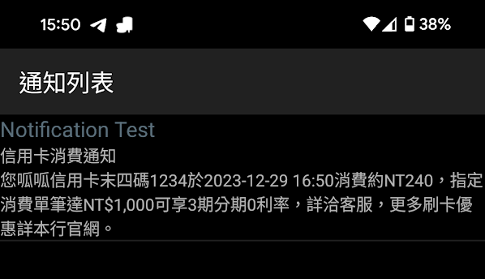
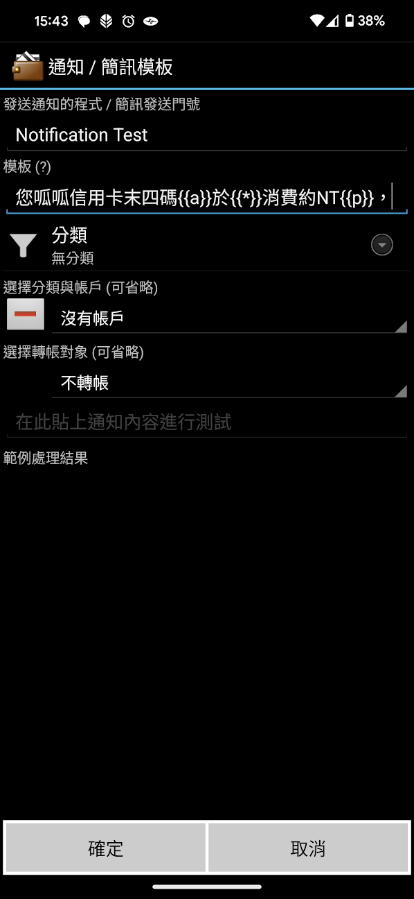
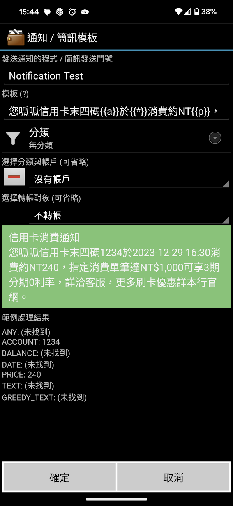
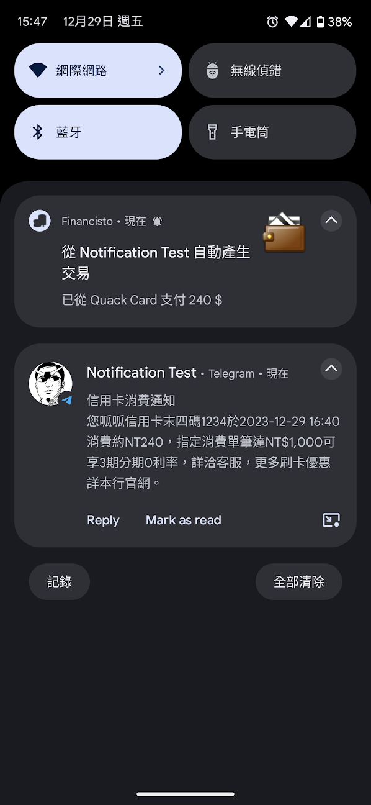
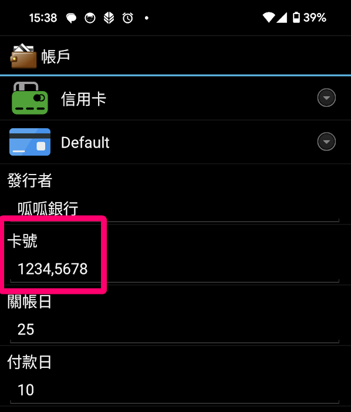

<nav>

**[Home](index.md)** · [Features](features.md) · [Notification templates](notification-templates.md) · [Intents](intents-and-integration.md) · [Currencies](currencies-and-exchange-rates.md) · [Reports](reports-and-budgets.md) · [Backup](backup-and-restore.md) · [Automation](automation-and-scripts.md) · [Changelog](changelog.md) · [Versions](versions-and-forks.md) · [Development](development.md) · [FAQ](faq.md) · [Resources](resources.md)

</nav>

# Notification templates

After you grant Financisto Holo permission to read notifications, it matches incoming notifications against rules you define and creates transactions from them. Any app that posts a notification can trigger a transaction: SMS messages, bank apps, or instant messengers. You could even message yourself from another phone to log a transaction.

This replaces the old SMS templates. Google no longer allows SMS permissions for new apps, so reading SMS directly isn't available in the Play build; with a notification template you can still parse SMS notifications. You can also build the app from source to get the old SMS behavior. See [Development](development.md).

## Create a template
1. Open the SMS/Notification template list. A button at the top right shows the notifications the app can currently see.
2. Make a purchase, or wait for the next one, then open that screen. The colored line is the notification title (the sender as the app sees it).
3. Tap a notification to copy its sender and content to the clipboard, then paste it into the template screen and edit it.
4. The body doesn't need to contain the whole message, only the relevant parts.
5. Tap **(?)** to see the placeholders.
6. Paste the original notification body into the test area to see how it extracts data.
7. Save. The next matching notification creates a transaction.

## Placeholders

| Placeholder | Meaning |
|---|---|
| `{{a}}` | Code used to look up the account |
| `{{e}}` | Payee name to look up in the database (see below) |
| `{{p}}` | The amount or price |
| `{{t}}` | Text extracted as the transaction note, non-greedy (as short as possible) |
| `{{u}}` | Text extracted as the transaction note, greedy (as long as possible) |
| `{{*}}` | Anything irrelevant; skips a dynamic part you don't need |
| `{{x}}` | Transfer-to account; supports all non-whitespace characters |
| `{{r}}` | Project title to match or create |
| `{{f}}` | Foreign currency as an ISO 4217 code |
| `{{g}}` | Transaction time as a Unix timestamp in milliseconds |

Placeholder notes drawn from the changelog:
- Account, payee and project names accept any non-whitespace characters, non-greedy. If you have templates from before 2026-06-22, you may need to adjust them.
- `{{e}}` is non-greedy, and the last placeholder automatically extends to the end of the text. It can match payee names containing spaces. If a template stops working after an update, anchor the payee with a fixed string after it.
- Titles can be partially matched with `%` as a wildcard. For `Money Out $123` use `Money Out %`; for `$567 received` use `% received`.
- The notification body is prefixed with its title, so values can be extracted from the title.
- Amounts with non-breaking spaces and `1,234` style prices are handled.
- Matching works by package name as well.
- Sender and pattern length limits were removed, and an invalid pattern no longer crashes the app.

## Choosing the account
Fill in the account's **Card Number** field with the text that appears in the notification, usually the last 4 digits. If several cards belong to one account, separate them with commas or spaces.

A template can also match an origin or transfer-to account from the notification title, and create a payee if it doesn't exist.

## Payee extraction
`{{e}}` marks the payee name. If a payee with a matching name is found, the transaction's payee is set to it and the category becomes that payee's last used category. A category chosen in the template always wins over the payee's last category.

**Aliases:** edit a payee and add an alias to make other names match it. For example, if your payee is "McD" but Google Wallet reports "McDonald's Restaurant", put the long name in the alias. An alias also helps search: a payee with alias "shinga" can be found by typing "sh".

You can also preselect the payee and project in the template.

## Transaction note
The note is filled in this order:
1. The custom note defined in the template, with text extracted via `{{t}}` or `{{u}}`.
2. If the template note is empty, text extracted from the notification, when available.
3. If there is still no note and no extraction is defined, the full notification body, when enabled in the config.

## Google Wallet
A Google Wallet payment notification can create a transaction automatically. It requires notification access.
- Name a Financisto account the same as the card shown after "with" in the notification.
- A card number, an account whose card number field contains the last 4 digits, or an account name contained in the card label also match.
- Transactions that have only a currency symbol are treated as local currency.
- The payee name is no longer stored as the note.

## Other details
- A new option matches the notification **group summary**, and the group summary is kept and highlighted. The app also tries to skip group summary notifications to avoid duplicates.
- Templates can fill in the **location** of the transaction.
- Tapping the notification of a generated transaction opens it; going back then returns to the main blotter before dismissing the app.
- The notification list is ordered by notification time.
- Notifications for created or restored scheduled transactions, and for transactions created from templates, are shown again on Android 8+. Sound and vibration are set in Android's system settings.
- The blotter refreshes automatically when new transactions are created in the background.
- Notification processing keeps working after an app update (a bug fix in the 2026-09 releases).

---

[← Back to Home](index.md)
